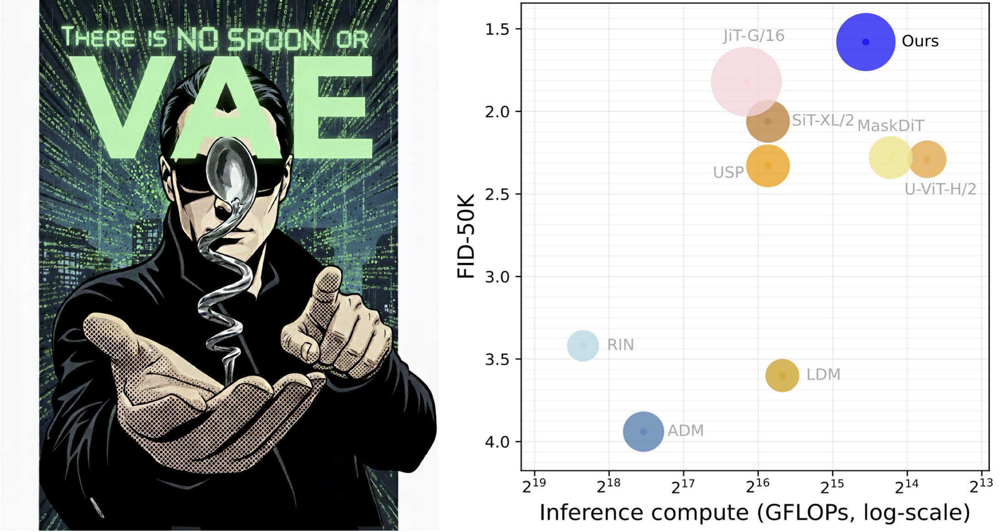

# Official Implementation of "There is No VAE: End-To-End Pixel-Space Generative Modeling Via Self-Supervised Pre-Training"
[](https://arxiv.org/pdf/2510.12586) [](https://amap-ml.github.io/EPG/)

This repository provides the official PyTorch implementation of EPG, a framework for training high-quality pixel-space image diffusion/consistency models through a two-stage pipeline: **SSL Pre-training followed by End-to-End Fine-tuning**.

:mag_right: **Simple yet effective solutions that substantially accelerate DM training without interfering the training pipeline**
- **Latent Space (USP)**: Accelerates training with a two-stage process: first, a powerful representation learning stage, then end-to-end fine-tuning. **Ref**: [Paper](https://arxiv.org/pdf/2503.06132), [GitHub](https://github.com/AMAP-ML/USP).
- **Pixel Space (MaskDM)**: Reduces training cost by pre-training on heavily masked images, then fine-tuning on full images. Ideal for limited compute and small datasets (e.g. Celeb-HQ). **Ref**: [Paper](https://arxiv.org/pdf/2306.11363).


<p><center>Figure 1: With SSL pre-training, our Pixel-Space diffusion transformer achieves 1.58 SOTA FID (with 75 NFE) on ImageNet-256.</center></p>

## News :fire:
- [2025.4.1] Release codes and checkpoints.
> Note: As of 2026.03, It's possible the training codes are not fully tested. Please let us know if you have any problems in reproducing our results.


## Dependencies
We list specific versions of dependencies in requirements.txt.
```bash
# Note: accelerate==0.24.0
pip install -r requirements.txt
```

## Dataset Preparation
Dataset file structure:
```python
ImageNet256/
    train/
      n01440764/
            0000.png
            0001.png
            ...
      n01443537/
      ...
```

Center-crop training images into target resolution (e.g. 256):
```bash
cd prepare_dataset

# Variables to be set in process.py
# TARGET_RESOLUTION = 256, target resolution, e.g., 256, 512
# SPLIT = "train", subset to process, [train, val]
# PATH_TO_RAW_DATASET = "" # path to the raw imagenet-1k dataset. e.g., /mnt/workspace/imagenet-1k
# DEST_FOLDER = "" # path to save processed images. e.g. /mnt/workspace/ImageNet512/
python process.py
```

## Training Scripts
```bash
# Pre-training
sh scripts/pretrain.sh

# Denoising tuning
sh scripts/denoise_tune.sh

# Consistency tuning
sh scripts/consistency_tune.sh
```

## Inference

interval guidance sampling utilizing heun sampler with 32 sampling steps.
```bash
run_args="--main_process_ip localhost \
        --main_process_port 12345 \
        --num_machines 1 \
        --machine_rank 0 \
        --mixed_precision no \
        --num_processes 8 \
      "

accelerate launch $run_args sample.py --config=configs/imagenet256_denoise.py \
      --config.path="path to folder that contains nnet_ema.pth" \
      --config.sample.path="path to save sampled images. if empty, temporary path will be used" \
      --config.dataset.data_dir="path to ImageNet256/train" \
      --config.sample.num_samples=10000 \
      --config.dataset.fid_stat_path="path to .npz of evaluation statistics" \
      --config.nnet.model_type="EPGViT" \
      --config.nnet.depth=12 \
      --config.nnet.num_heads=12 \
      --config.nnet.embed_dim=768 \
      --config.nnet.decoder_depth=12 \
      --config.nnet.decoder_num_heads=22 \
      --config.nnet.decoder_embed_dim=1584 \
      --config.sample.sampling_step=32 \
      --config.sample.sampler="heun" \
      --config.sample.cfg_scale=$scale \
```
## FID Evaluation
- Step1: convert generated images into .npz file.
```bash
cd evaluations
python prepare_npz.py [path to folder that contains generated images]
```
- Step2: compute FID score given reference npz file from ADM. Please refer to the [ADM repository](https://github.com/openai/guided-diffusion ) to download the reference npz file and setup necessary environments.
```bash
# in ./evaluations
python evaluator.py  [path to reference .npz] [path to .npz of generated images]
```
## Checkpoints
We release checkpoints of our pre-trained and fine-tuned models in the paper.

**Table 1:** Pre-trained model.
| Model | Dataset | Download Link |
| -- | -- | -- |
| RCM-B | IN-256 | [download](https://huggingface.co/jiachenlei/EPG/tree/main/RCM-B-IN256) |
| RCM-B | IN-512 | [download](https://huggingface.co/jiachenlei/EPG/tree/main/RCM-B-IN512) |
| RCM-L | IN-256 | [download](https://huggingface.co/jiachenlei/EPG/tree/main/RCM-L-IN256) |


**Table 2:** Fine-tuned model configurations. Encoder and decoder settings are separated by comma.
| Name | Blocks | Dim | Heads | Params |
| -- | -- | -- | -- | -- |
| EPG-L | 16, 16 | 1024, 1024 | 16, 16 | 540M |
| EPG-XL | 12, 12 | 768, 1584 | 12, 22 | 583M |
| EPG-XXL | 12, 12 | 768, 1920 | 12, 16 | 789M |
| EPG-G | 12, 12 | 768, 2688 | 12, 21 | 1391M |

**Table 3:** Fine-tuned model performance in downstream tasks.
| Model | Task | FID  | Download Link |
| -- | -- | -- | -- |
| EPG-XL/16 | DM on IN-256 | 2.04 | [download](https://huggingface.co/jiachenlei/EPG/tree/main/EPG-XL16-imagenet256) |
| EPG-XXL/16 | DM on IN-256 | 1.87 | [download](https://huggingface.co/jiachenlei/EPG/tree/main/EPG-XXL16-imagenet256) |
| EPG-G/16 | DM on IN-256 | 1.58 |  [download](https://huggingface.co/jiachenlei/EPG/tree/main/EPG-G16-imagenet256) |
| EPG-L/32 | DM on IN-512 | 2.35 | [download](https://huggingface.co/jiachenlei/EPG/tree/main/EPG-L32-imagenet512) |
| EPG-L/16 | CM on IN-256 | 8.82 | [download](https://huggingface.co/jiachenlei/EPG/tree/main/EPG-L16-imagenet256-onestep) |

<!-- **Table 3:** Pre-trained encoders.
| Model | Task | Model type | Download Link |
| -- | -- | -- | -- |
| RCM  | Pre-train on IN-256 | encoder of Large, 16-layer | |
| RCM  | Pre-train on IN-512 | encoder of Large, 16-layer | |
| RCM  | Pre-train on IN-256 | encoder of XL, 12-layer | | -->


## Reproducibility
You could reproduce FID reported in our paper by running the following commands. You shall specify the path to the directory that contains model weights and modify necessary parameters in the scripts.
```bash
# EPG's DM variant
sh scripts/sample_dm_in256.sh # sample EPG-XL/16 trained on IN-256
sh scripts/sample_dm_in512.sh # sample EPG-L/32 trained on IN-512

# EPG's CM variant
sh scripts/sample_cm_in256.sh # sample EPG-L/16 trained on IN-256
```

## Citation
```
@article{lei2025advancing,
  title={There is No VAE: End-to-End Pixel Space Generative Modeling via Self-supervised Pre-training},
  author={Lei, Jiachen and Liu, Keli and Berner, Julius and Yu, Haiming and Zheng, Hongkai and Wu, Jiahong and Chu, Xiangxiang},
  journal={arXiv preprint arXiv:2510.12586},
  year={2025}
}
```
</br>

:star2: **If you find our codes useful, please do not hesitate to star our github repo.**

> As of 2026.04.01, it's possible the training codes are not fully tested. Please let us know if you have any problems in reproducing the results.

### Acknowledgement
Our codes are built upon the following repositories:
> ADM: https://github.com/openai/guided-diffusion  
> DiT: https://github.com/facebookresearch/DiT  
> U-ViT: https://github.com/baofff/U-ViT/  
> Consistency Model (CM): https://github.com/openai/consistency_models  
> ECT: https://github.com/locuslab/ect  