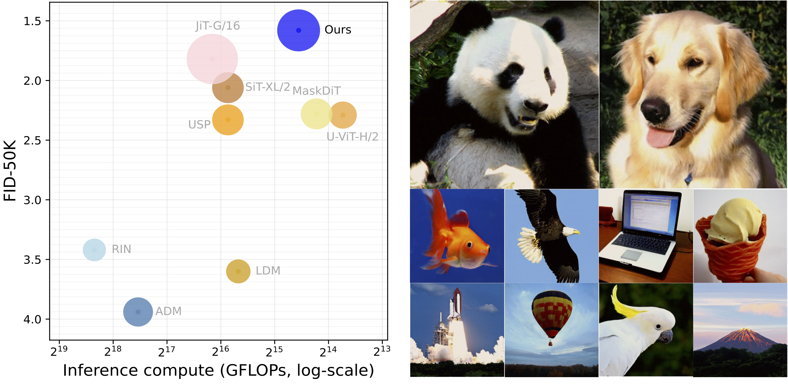
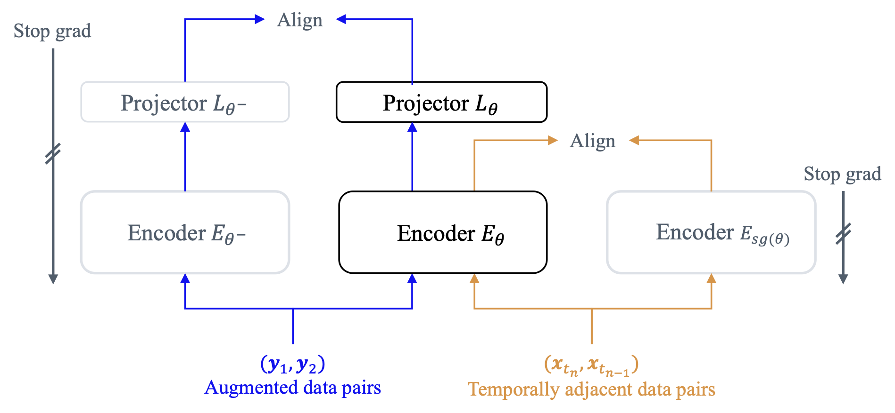
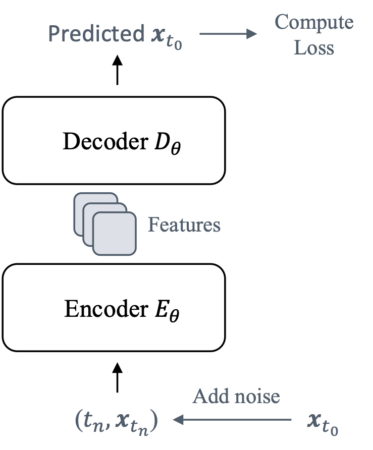

# Official Codes for: "Advancing End-To-End Pixel-Space Generative Modeling Via Self-Supervised Pre-Training"
[](https://arxiv.org/pdf/2510.12586) [](https://amap-ml.github.io/EPG/)

This repository provides the official PyTorch implementation of EPG, a framework for training high-quality pixel-space image generation models through a two-stage pipeline: **SSL Pre-training followed by End-to-End Fine-tuning**, adapting self-supervised image classifier training principles to diffusion/consistency models (DM/CM).

:mag_right: **Recommended methods that accelerate DM training via pre-training**
- **Latent Space (USP)**: Accelerates training with a two-stage process: first, a powerful representation learning stage, then end-to-end fine-tuning. **Ref**: [Paper](https://arxiv.org/pdf/2503.06132), [GitHub](https://github.com/AMAP-ML/USP).
- **Pixel Space (MaskDM)**: Reduces training cost by pre-training on heavily masked images, then fine-tuning on full images. Ideal for limited compute or small datasets (e.g. Celeb-HQ). **Ref**: [Paper](https://arxiv.org/pdf/2306.11363).


<p><center>Figure 1: Our model achieves SOTA FID 1.58 (with 75 NFE) on ImageNet-256. We display some qualitative results displayed above.</center></p>

## News
- [2025.12.02] Upload checkpoints and inference code


## Environment Setup
We list specific versions of dependencies in requirements.txt.
```bash
# We use python==3.9.0
pip install -r requirements.txt
```

## Dataset Preparation
Dataset file structure:
```python
ImageNet256/
    train/
      n01440764/
            0000.JPEG
            0001.JPEG
            ...
      n01443537/
      ...
```

Center-crop training images into target resolution (e.g. 256):
```bash
cd prepare_dataset

# Required variables:
# TARGET_RESOLUTION = 256, target resolution, e.g., 256, 512
# SPLIT = "train", subset to process, [train, val]
# SOUCE_TO_RAW_DATASET = "" # path to the raw imagenet-1k dataset. e.g., /mnt/workspace/imagenet-1k
# DEST_FOLDER = "" # path to save processed images. e.g. /mnt/workspace/ImageNet512/
python process.py
```

## Training
> Stay tuned, working on it.

<!-- <div style="display:inline-block">


<p>
<center>Figure 2: Our pre-training (left) and fine-tuning pipeline (right). After pre-training, we only keep Encoder $E_\theta$ while discarding other components. See our <a href="https://arxiv.org/pdf/2510.12586">paper</a> for more details.</center>
</p>
<div> -->


## Inference
```bash
run_args="--main_process_ip localhost \
        --main_process_port 12345 \
        --num_machines 1 \
        --machine_rank 0 \
        --mixed_precision no \
        --num_processes 8 \
"
# interval guidance sampling utilizing heun sampler with 32 sampling steps
accelerate launch $run_args sample.py --config=configs/imagenet256_denoise.py \
      --config.path="path to folder that contains nnet_ema.pth" \
      --config.sample.path="path to save sampled images. if empty, temporary path will be used" \
      --config.dataset.data_dir="path to ImageNet256/train" \
      --config.sample.num_samples=10000 \
      --config.dataset.fid_stat_path="path to .npz of evaluation statistics" \
      --config.nnet.model_type="DMViT" \
      --config.nnet.depth=12 \
      --config.nnet.num_heads=12 \
      --config.nnet.embed_dim=768 \
      --config.nnet.decoder_depth=12 \
      --config.nnet.decoder_num_heads=22 \
      --config.nnet.decoder_embed_dim=1584 \
      --config.nnet.tokens=1 \
      --config.ema_scale.start_scales=1280 \
      --config.ema_scale.scale_mode="fixed" \
      --config.diffusion.shift_sigma=True \
      --config.sample.sampling_step=32 \
      --config.sample.mode="cond" \
      --config.sample.sampler="heun" \
      --config.diffusion.prediction_target="x0" \
      --config.sample.mini_batch_size=100 \
      --config.dataset.image_size=256 \
      --config.nnet.image_size=256 \
      --config.nnet.num_classes=1000 \
      --config.dataset.class_cond=True \
      --config.sample.cfg_scale=$scale \
```
## Evaluation
Evaluating the FID score
- Step1: convert generated images into npz file.
```bash
cd evaluations
python prepare_npz.py [path to folder that contains generated images]
```
- Step2: compute FID score given reference npz file from ADM. Please refer to the [ADM repository](https://github.com/openai/guided-diffusion ) to install necessary environments and download reference npz file.
```bash
python evaluator.py  [path to npz file of npz file from ADM] [path to npz file of generated images]
```
## Checkpoints
We open-source checkpoints of our models fine-tuned in downstream tasks. More checkpoints are coming, stay tuned.

**Table 1:** Network configurations. Encoder and decoder settings are separated by comma.
| Name | Blocks | Dim | Heads | Params |
| -- | -- | -- | -- | -- |
| EPG-L | 16, 16 | 1024, 1024 | 16, 16 | 540M |
| EPG-XL | 12, 12 | 768, 1584 | 12, 22 | 583M |
| EPG-XXL | 12, 12 | 768, 1920 | 12, 16 | 789M |
| EPG-G | 12, 12 | 768, 2688 | 12, 21 | 1391M |

</br>

**Table 2:** Fine-tuned model in downstream tasks. FID50K, Heun32, Random sampling.
| Model | Task | FID  | Download Link |
| -- | -- | -- | -- |
| EPG-XL/16 | DM on IN-256 | 2.04 | [download](https://huggingface.co/jiachenlei/EPG/resolve/main/EPG-XL16-imagenet256.pth?download=true) |
| EPG-XXL/16 | DM on IN-256 | 1.87 | [download](https://huggingface.co/jiachenlei/EPG/resolve/main/EPG-XXL16-imagenet256.pth?download=true) |
| EPG-G/16 | DM on IN-256 | 1.70 |  [download](https://huggingface.co/jiachenlei/EPG/resolve/main/EPG-G16-imagenet256.pth?download=true) |
| EPG-L/32 | DM on IN-512 | 2.35 | [download](https://huggingface.co/jiachenlei/EPG/resolve/main/EPG-L32-imagenet512.pth?download=true) |
| EPG-L/16 | CM on IN-256 | 8.82 | [download](https://huggingface.co/jiachenlei/EPG/resolve/main/EPG-L16-imagenet256-onestep.pth?download=true) |

<!-- **Table 3:** Pre-trained encoders.
| Model | Task | Model type | Download Link |
| -- | -- | -- | -- |
| RCM  | Pre-train on IN-256 | encoder of Large, 16-layer | |
| RCM  | Pre-train on IN-512 | encoder of Large, 16-layer | |
| RCM  | Pre-train on IN-256 | encoder of XL, 12-layer | | -->


## Reproducibility
You could reproduce FID reported in our paper by running the following commands. Before that, you should specify the path to the model weights and modify necessary parameters in the scripts.
```bash
# EPG's DM variant
sh scripts/sample_dm_in256.sh # sample EPG-XL/16 trained on IN-256
sh scripts/sample_dm_in512.sh # sample EPG-L/32 trained on IN-512

# EPG's CM variant
sh scripts/sample_cm_in256.sh # sample EPG-L/16 trained on IN-256
```

## Citation
```
@article{lei2025advancing,
  title={Advancing End-to-End Pixel Space Generative Modeling via Self-supervised Pre-training},
  author={Lei, Jiachen and Liu, Keli and Berner, Julius and Yu, Haiming and Zheng, Hongkai and Wu, Jiahong and Chu, Xiangxiang},
  journal={arXiv preprint arXiv:2510.12586},
  year={2025}
}
```
</br>

:star2: **If you find our codes useful, please do not hesitate to star our github repo.**

### Acknowledgement
Our codes are built upon the following repositories:
> ADM: https://github.com/openai/guided-diffusion  
> DiT: https://github.com/facebookresearch/DiT  
> U-ViT: https://github.com/baofff/U-ViT/  
> Consistency Model (CM): https://github.com/openai/consistency_models  
> ECT: https://github.com/locuslab/ect  